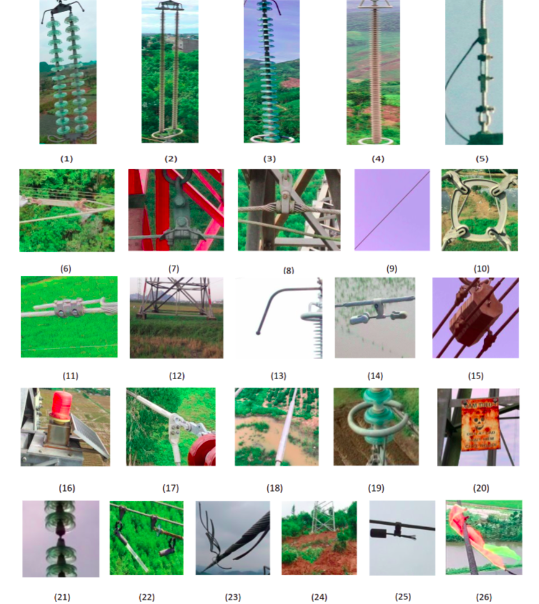

## 1. Dataset
Dataset contains 59911 images taken from flying-cam devices (Phantom 4 RTK) with very high resolutions in range of 12-20 Mpx. The captured areas include mountains, forests and flats. For safety, the images were captured at least 5 meters from the devices with many different shooting angles. Then, they were automatically uploaded and labeled using our system. The dataset is composed of 26 components as described in Table 1.

Table 1: Dataset description

|       |Label                       | Quantity|
|-------|----------------------------|---------|
| 1     | Double insulator           | 3797 |
| 2     | Double insulator composite | 1834 |
| 3     | Single insulator           | 4929 |
| 4     | Single insulator composite | 1984 |
| 5     | Sag adjusting plate        | 2500 |
| 6     | Turnbuckle                 | 3469 |
| 7     | Triangle type yoke         | 2245 |
| 8     | Suspension clamp           | 2469 |
| 9     | Wire                       | 5556 |
| 10    | Spacer                     | 4132 |
| 11    | Tower attachment           | 6877 |
| 12    | Foundation                 | 2677 |
| 13    | Arcing horn                | 5645 |
| 14    | Dampers                    | 9343 |
| 15    | Counter weight piece       | 3254 |
| 16    | Warning lights             | 1507 |
| 17    | Tension clamp              | 7322 |
| 18    | Compression connector tube | 3055 |
| 19    | Corona ring                | 3168 |
| 20    | Warning sign faut          | 1471 |
| 21    | Insulator fault            | 5228 |
| 22    | Wire fault                 | 2499 |
| 23    | Spacer fault               | 1628 |
| 24    | Foundation fault           | 233  |
| 25    | Dampers fault              | 467  |
| 26    | Foreign object             | 2996 |

   
   
Fig. 1. Visualization of the dataset composing of: (1) Double insulator, (2) Double insulator composite, (3) Single insulator, (4) Single insulator composite, (5) Sag adjusting plate, (6) Turnbuckle, (7) Triangle type yoke, (8) Suspension clamp, (9) Wire, (10) Spacer, (11) Tower attachment , (12) Foundation, (13) Arcing horn, (14) Dampers, (15) Counter weight piece, (16) Warning lights ,(17) Tension clamp, (18) Compression connector tube, (19) Corona ring (20) Warning sign fault, (21) Insulator fault, (22) Wire fault, (23) Spacer fault, (24) Foundation fault (25) Dampers fault, (26) Foreign object.
